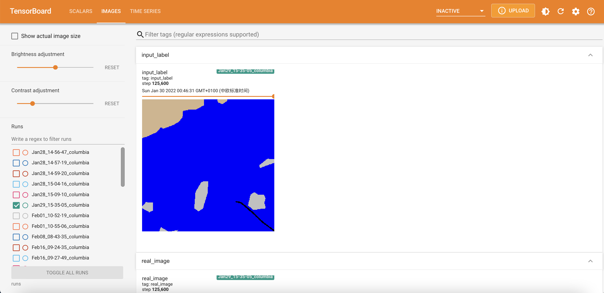

# Label2Scene

#### 通过Semantic Segmentation的结果生成相应的图像


## 数据集

Landcover数据集，可以从此链接下载：https://landcover.ai/

此数据集包含两种方式，一个是三分类，一个是四分类

A. building (1), woodland (2), water(3), road(4)

B. building (1), woodland (2), water(3) 

我选用的是A，实际总共是五个class，（0）表示background，field之类的class

### 数据预处理


方法1:

此数据集原图像是`9000x9500px`的大图，首先需要通过提供的图像分割代码`split.py`，将数据预处理成小的图像。这里可以自由选择分辨率，我选择的是`1024x1024px`

方法2:

在google drive中我提供了数据预处理之后的data，可以放在一个目录中，通过修改训练命令行中的地址修改文件路径

下载链接：（目前还没有，传的很慢）


## 训练

### 训练命令行
```bash
python train.py --name label2landcover --dataset_mode custom --label_dir ../data/landcover/outputs/masks --image_dir ../data/landcover/outputs/images --label_nc 5 --no_instance --tf_log --display_freq 400 --use_vae
```
`--name`表示在checkpoints文件夹中保存的名字，之后测试也是直接使用此设定的名字，此名字可以自己任意选取，就是文件夹的命名

`--dataset_mode`必须是custom因为这里是我们自己的数据集，不是论文中的

`--image_dir`和`--label_dir`表示训练数据集的位置，分别是图像原图和分割结果


`--label_nc`必须为5，因为这里总共是0，1，2，3，4 五个class

`--no_instance`必须加入，因为我们没有instance label是senmantic label，论文中有很多数据集有instance label，因此可以生成更多不同风格的相同class的结果

`--tf_log`训练时加上，可以在tensorboard中观察结果

`--use_vae`使用vae时给予multimodal考虑的，可以使得生成的结果更加多样化，而不是一个label一种形态，可以作为训练时调参的选择，但我训练后发现没啥不同lol

`--display_freq`表示可视化的频率，建议把频率设大，否则图像到tensorboard中会有延时，如果freq过高，可能label和scene不能匹配上

### 训练结果

1. 运行训练代码就会生成一个文件夹**checkpoints**， 如果训练时加上`--tf_log`，还会生成一个**runs**文件夹。 **checkpoints**文件夹中保存了每个epoch的模型，已经一些validation的结果， **runs**文件夹中是tensorboard的信息

2. 实时观察训练结果，可以通过Tensorboard，通过命令行 `tensorboard --logdir runs`可以选择需要查看的experiemnt




## 测试 

```bash
python test.py --name label2landcover --dataset_mode custom --label_dir ../data/test/masks --image_dir ../data/test/images --label_nc 5 --no_instance --use_vae --tf_log
```

通过此链接可以下载预训练模型的一整个folder，将此folder直接放到checkpoints文件夹中，此时命令行中`--name`即表示此文件夹的名称，test.py代码会自动找寻此文件夹中指定的预训练模型

预训练模型的link： （目前也没有，还在上传比较慢）

`--image_dir`和`--label_dir`表示数据集的位置，需要修改成对应的文件路径

最后结果可以在生成的**results**文件夹中查看。


